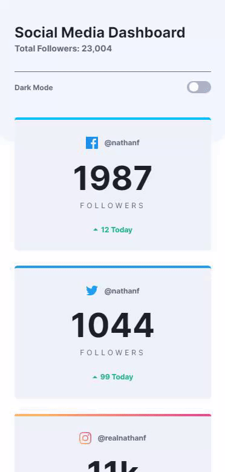
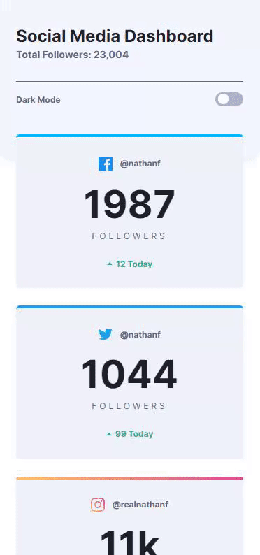
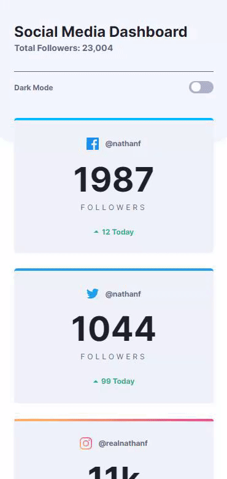
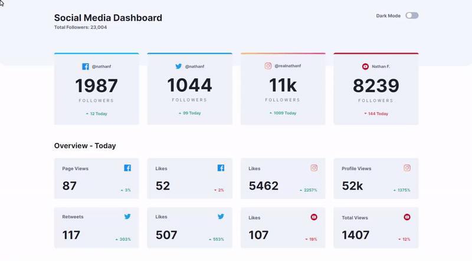
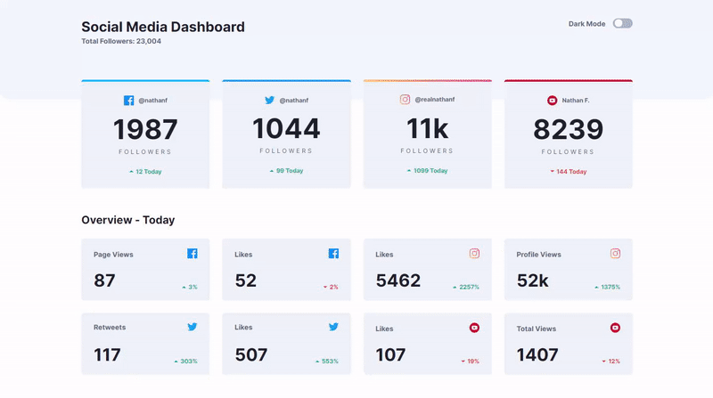
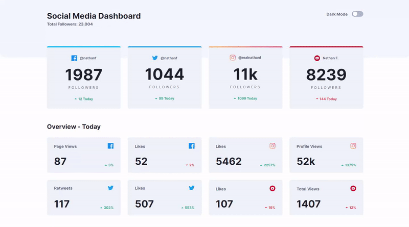

# Frontend Mentor - Social media dashboard with theme switcher

    

###### 

 

## Mobile version preview

 

## Desktop version preview

###### 

###### 

######  

To view the project recreated by me, visit: https://social-media-dashboard-tau.now.sh/

## The challenge

- This challenge is to build out this Social Media Dashboard and get it looking as close to the design as possible.

  The users should be able to:
  - View the optimal layout for the site depending on their device's screen size
  - See hover states for all interactive elements on the page
  - Toggle color theme to their preference

## Installation

1. Clone this repository to your machine

2. Open the project and run

   1. `$ npm install`

   2. `$ gulp run`

      

## Thanks

[Frontend Mentor](https://www.frontendmentor.io/) for this challenge and [Social Media Dashboard](https://www.frontendmentor.io/challenges/social-media-dashboard-with-theme-switcher-6oY8ozp_H) design resources

## License

All the code available under the MIT + Apache 2.0. licenses. See [LICENSE](https://github.com/joaopaulogn/frontend-mentor-social-media-dashboard/blob/master/LICENSE).